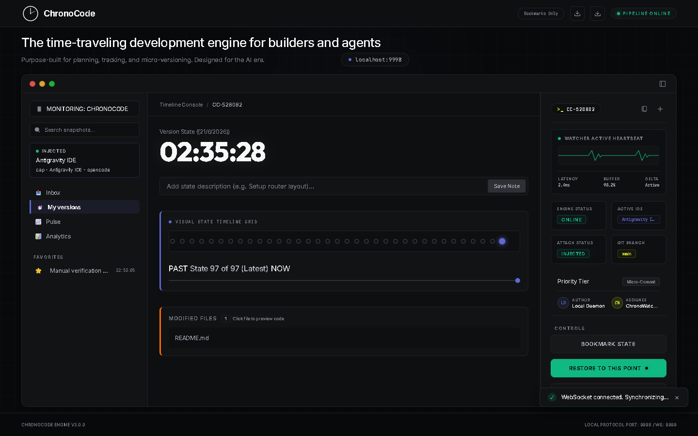

<div align="center">


# ChronoCode

### Time-traveling dev engine for builders & agents

**Automatic micro-versioning. Real-time file telemetry. Instant restoration.**

<br />

[](https://github.com/harshkhatri7/ChronoCode-web/blob/main/LICENSE)
[](https://github.com/harshkhatri7/ChronoCode-web/releases/latest)
[](https://chronocode.netlify.app)
[](https://nodejs.org)
[](https://electronjs.org)
[](https://github.com/harshkhatri7/ChronoCode-web/stargazers)
[](https://github.com/harshkhatri7/ChronoCode-web/issues)
[](https://github.com/harshkhatri7/ChronoCode-web/commits)
[](https://github.com/harshkhatri7/ChronoCode-web/pulls)

<br />

[](https://github.com/harshkhatri7/ChronoCode-web/releases/latest)
[](https://github.com/harshkhatri7/ChronoCode-web/releases/latest)
[](https://github.com/harshkhatri7/ChronoCode-web/releases/latest)

<br />

[Documentation](https://chronocode.netlify.app/docs/) | [Download](https://chronocode.netlify.app/download.html) | [Support](https://chronocode.netlify.app/support.html) | [Report Issue](https://github.com/harshkhatri7/ChronoCode-web/issues)

</div>

---

## What is ChronoCode?

ChronoCode is a **universal time-traveling development engine** that watches your workspace, captures **micro-versioned snapshots** on every save, and gives you an interactive dashboard to browse, compare, and restore any previous state of your code.

> Built for the AI coding era. Zero Git configuration required.



---

## Features

<table>
<tr>
<td width="50%">

### Real-Time File Watcher
Low-level directory watcher captures modifications immediately on save. Zero config, zero lag. Uses `chokidar` for cross-platform file system events.

</td>
<td width="50%">

### Micro-Versioning Snapshots
Compressed local diff archives. Step backward or forward through time at millisecond scale. Every save creates a versioned snapshot automatically.

</td>
</tr>
<tr>
<td width="50%">

### Smart IDE Injection
Tracks your focus dynamically. Integrated with Cursor, VS Code, Zed, Windsurf, and more. Tags each version with the active IDE and file.

</td>
<td width="50%">

### One-Click Restores
Find the version you need, click Restore, and your workspace reverts instantly. Zero CLI friction. Side-by-side diffs included.

</td>
</tr>
<tr>
<td width="50%">

### Interactive Dashboard
Browse your entire code history with a visual timeline. Compare any two snapshots, bookmark important versions, and track your coding velocity.

</td>
<td width="50%">

### Anti-Crack Protection
Built-in JS obfuscation compiler keeps your workspace safe from unauthorized source leaks. Enterprise-grade security for your code.

</td>
</tr>
</table>

---

## Quick Start

Get up and running in 3 steps:

### 1. Clone the repository

```bash
git clone https://github.com/harshkhatri7/ChronoCode-web.git
cd ChronoCode-web
```

### 2. Install dependencies

```bash
npm install
```

### 3. Start the engine

```bash
npm start
```

Open `http://localhost:3000` in your browser. ChronoCode will begin watching your workspace immediately.

---

## Installation

### From Source

```bash
# Clone the repository
git clone https://github.com/harshkhatri7/ChronoCode-web.git
cd ChronoCode-web

# Install dependencies
npm install

# Start the telemetry server
npm start
```

### Download Pre-built Binaries

| Platform | File | Link |
|----------|------|------|
| **Windows** | `.exe` (x64) | [Download](https://github.com/harshkhatri7/ChronoCode-web/releases/latest) |
| **macOS** | `.dmg` (Universal) | [Download](https://github.com/harshkhatri7/ChronoCode-web/releases/latest) |
| **Linux** | `.AppImage` (x64) | [Download](https://github.com/harshkhatri7/ChronoCode-web/releases/latest) |

### System Requirements

- **OS:** Windows 10+, macOS 12+, Ubuntu 20+
- **Node.js:** v18.0 or higher
- **RAM:** 512MB minimum
- **Disk:** 100MB for snapshots (scales with project size)

---

## Tech Stack

| Layer | Technology |
|-------|-----------|
| **Runtime** | Node.js + Electron |
| **Server** | Express.js |
| **File Watching** | Chokidar v4 |
| **Real-time** | WebSocket (ws) |
| **Frontend** | Vanilla JS + Custom CSS |
| **Desktop** | Electron Builder |

---

## How It Works

```
┌─────────────┐     ┌──────────────┐     ┌──────────────┐
│  File Save   │────▶│  Chokidar    │────▶│  Snapshot    │
│  Event       │     │  Watcher     │     │  Engine      │
└─────────────┘     └──────────────┘     └──────┬───────┘
                                                │
                    ┌──────────────┐     ┌──────▼───────┐
                    │  Dashboard   │◀────│  Diff Store  │
                    │  (Browser)   │     │  (Local)     │
                    └──────────────┘     └──────────────┘
```

1. **Watch** -- Chokidar monitors your workspace for file changes
2. **Snapshot** -- On each save, a compressed diff is created and stored locally
3. **Browse** -- Open the dashboard to view your timeline, compare versions, and restore

---

## Project Structure

```
ChronoCode-web/
├── assets/
│   ├── logo.svg          # ChronoCode logo
│   └── logo.png          # Logo fallback
├── docs/
│   ├── index.html        # Documentation page
│   └── styles.css        # Docs styles
├── index.html            # Landing page
├── download.html         # Download page
├── support.html          # Support page
├── styles.css            # Global design system
├── app.js                # Interactive controller
├── robots.txt            # SEO crawl rules
├── sitemap.xml           # Search engine sitemap
└── render.yaml           # Deployment config
```

---

## Contributing

Contributions are welcome! Here's how to get started:

1. **Fork** the repository
2. **Create** a feature branch (`git checkout -b feature/amazing-feature`)
3. **Commit** your changes (`git commit -m 'Add amazing feature'`)
4. **Push** to the branch (`git push origin feature/amazing-feature`)
5. **Open** a Pull Request

Please read [CONTRIBUTING.md](https://github.com/harshkhatri7/ChronoCode-web/blob/main/CONTRIBUTING.md) for details.

---

## Roadmap

- [ ] VS Code extension for inline timeline
- [ ] Cloud sync for snapshots
- [ ] Team collaboration mode
- [ ] AI-powered code analysis
- [ ] CLI tool for headless environments
- [ ] Git integration layer

---

## License

This project is licensed under the **MIT License** -- see the [LICENSE](https://github.com/harshkhatri7/ChronoCode-web/blob/main/LICENSE) file for details.

---

## Author

Built by **[Harsh Khatri](https://github.com/harshkhatri7)**

---

<div align="center">

**[Website](https://chronocode.netlify.app)** | **[Documentation](https://chronocode.netlify.app/docs/)** | **[Downloads](https://chronocode.netlify.app/download.html)** | **[GitHub](https://github.com/harshkhatri7/ChronoCode-web)**

</div>
